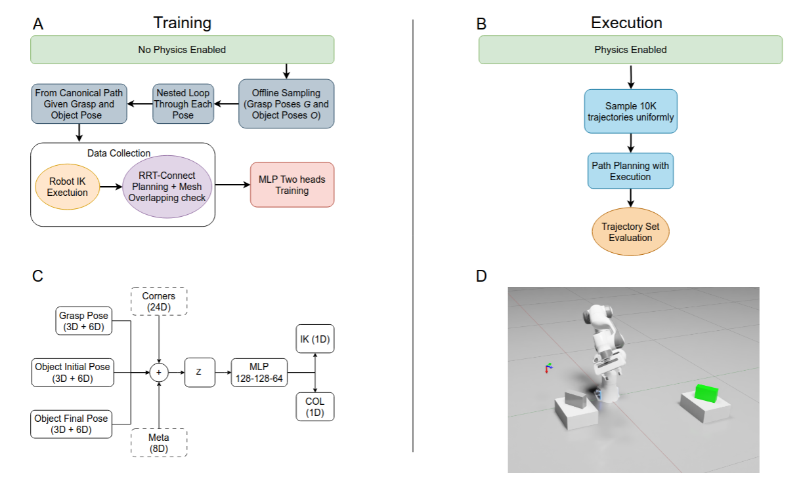

# Placement Quality for a Single Cuboid

A simulation-driven robotics project for predicting grasp-conditioned placement quality on a single cuboid object.

This repository explores how grasp choice affects downstream placement feasibility and quality, using physics-based simulation, motion validation, and learning-based scoring to support more efficient robot decision-making.

## System diagram



**System overview.** Offline object and grasp poses are sampled in simulation without physics, path-wise IK and collision labels are generated, and a dual-head MLP is trained to predict IK and collision feasibility. The learned scores are then evaluated under physics-enabled execution using motion planning and large-scale executed-simulation rollouts.

## Overview

In many pick-and-place systems, grasping and placing are treated as separate problems. This project studies their coupling by asking a more specific question:

**Given a candidate grasp and a target placement pose, can the robot place the object successfully and reliably?**

The repository focuses on a single cuboid setting and uses simulation to generate labeled data for learning grasp-conditioned placement feasibility and quality.

## Project goals

- Generate candidate grasps and target placements in simulation
- Evaluate placement feasibility under kinematic and collision constraints
- Collect large-scale labeled data for grasp–place pairs
- Train predictive models to estimate placement quality
- Support rank-then-plan execution by filtering or prioritizing promising candidates

## Main idea

Instead of planning every grasp-place pair from scratch at runtime, this project builds a predictive model from simulation-generated data.

The general workflow is:

1. Generate candidate grasps for an object
2. Sample target placement poses
3. Evaluate each grasp–placement pair in simulation
4. Label outcomes based on feasibility and execution-related criteria
5. Train a model to predict placement quality from grasp and pose information
6. Use the learned model to rank candidates before expensive planning

This makes the pipeline useful for reducing planning cost while preserving feasible robot behavior.

## Repository structure

```text
.
├── cube_generalization/   # Learning and generalization-related components
├── cube_simulation/       # Core cuboid simulation pipeline
├── path_simulation/       # Path-related validation / trajectory evaluation
├── ycb_simulation/        # Additional simulation experiments on object sets
├── docker_files/          # Docker build and environment setup files
├── configs/               # Configuration files
├── docs/                  # Setup notes, troubleshooting, and legacy notes
├── requirements.txt
├── run_pipeline.sh
└── README.md